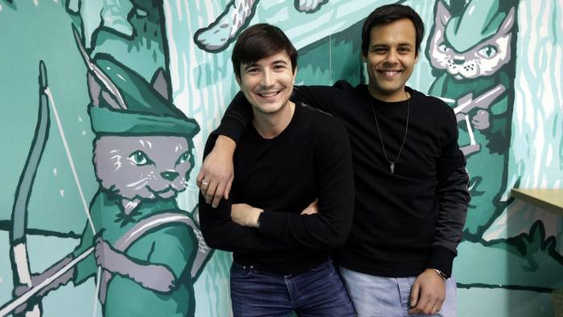
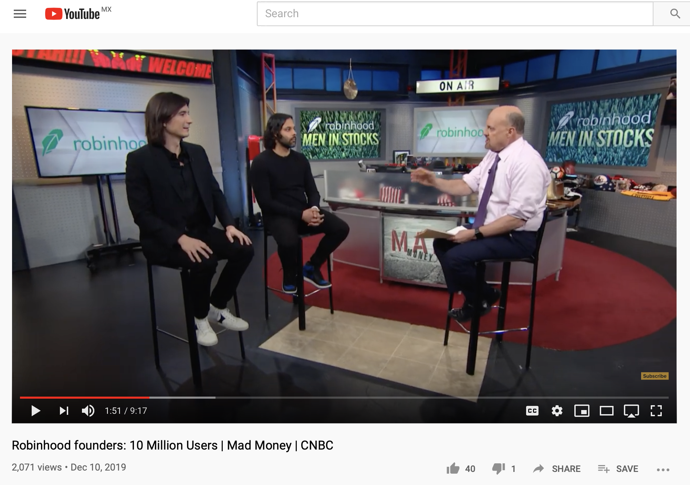
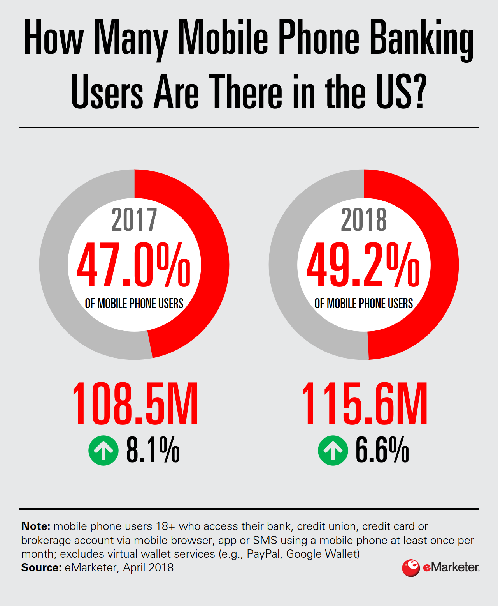

# hw1_fintechcasestudy


# <head>Robinhood [link](https://robinhood.com/us/en/)

## Overview and Origin




Founded in 2013 by Baiju Bhatt and Vlad Tenev, Robinhood was conceived to democratise finance. 

After graduating from Stanford the 2 entrepeneurs decided to break parafigmas and disrupt the way Wall Street traditionally functiones by giving acces to the financial markets to everyone with the use of technology.

With that mission in their mind Baiju and Vlad got in to a plane to to New York City. There they founded two finance companies and soon realised there was an opportunity to bring investors closer and cheaper to the markets. Thus, they created a comission free investing app or in other words *Free Stock Trading for Millenials*


It was a matter of time until the startup company started to gain the attention of angel investors, venture capital and private equity funds. 

According to crunchbase.com, as today it has raised a total of $912M in funding in over 10 rounds. The last one in Oct 29, 2019 from a Series E round that included big investor names such as:

* Ribbit Capital
* Sequoia
* Nea 
* Thrive Capital 

:smiley: :dollar: :computer: 

## Business Activities:
Robinhood challenges banks and traditional brokerage firms using technology to reduce transaction costs and eliminating stock/ETF's trading barries common people face.

Through its exceptionally engineered systems, RH's team make financial markets accesible to a new generation of investors in a simple and secure way.

In the beginning, the 2008 just after the financial crisis happened, the company focused on having two products: **comission-free trades of stock and ETF's** targetting millenials.

Quoting Anthony Noto's words , CEO of SOFI, who appeared in Jim Cramer's CNBC TV show "Mad Money" on Nov 22 2019: "Millenials love ETFs and fractinal shares that give them diversification at a small price point".

Most of Robinhood clients have not previous experience trading, but are attracted by the application's simplicity and transparency, the later value became much more important specially after the 2008 finance.

Today one Robinhood products include cash management. stocks and funds, options, funds and cryptocurrency

<span style="color:green">Meet the company's founders and hear from them their mission. How did they attracted +10 M</span>.


[](https://www.youtube.com/watch?v=S2moqXqqJTI)


## Landscape:
Even though he Mobile Trading Industry has been around for many years, with the most traditional players being Fidelity, Charles Schwab and E*Trade, the broader usage of cellular phones and the adaptation of easy to use apps has allow it to grow massively.

Caroline Cakebread from emarketer pro, in one of her Mobile Series articles estimates that 115.6 million phone users in the US will bank on mobile at least once per month. 




However, according to a survey from Morning Consult found that only 8% of internet users trade in stocks. This represents a big market opportunity for mobile trading companies.


```
Graphs and data taken from emarketer.com/ For More information, visit:
https://content-na1.emarketer.com/is-mobile-phone-banking-usage-near-saturation
```
## Competitors


<table border="5">
 <tr>
    <td><b style="font-size:30px">Fidelity</b></td>
    <td><b style="font-size:30px">TD Ameritrade</b></td>
     <td><b style="font-size:30px">Betterment</b></td>
 </tr>
 <tr>
    <td>www.fidelity.com</td>
    <td>www.amtd.com</td>
    <td>www.betterment.com</td>
 </tr>
</table>

Investopia's 2020 Best Online Brokers Awards
<b style="font-size:40px">!:trophy:</b>(https://www.investopedia.com/broker-awards-4587871)

## Recommendation


Its' technologic and data moats in addition with their no commision free investing value proposition has changed the way the industry used to work by increasing competition traditional financial institutions reduced their costs too!!! as a result we have all benefit from its existance.

In addition to the cost advantages, robinhood was also a pioneer in introducing fractional shares investments through an app. By allowing investors to invest as little as $1 in any stock, it has gained a lot of interest with investors that werent able to buy expensive per share tickets ot cryptos.

Due to the increasing competition in the market and the large investments that the traditional players are making to re gain market share I see the usage of Machine Learning and AI as an opportunity for Robinhood. 


---

Keynotes

I could not open a Robinhood account for not having a ss number :(


